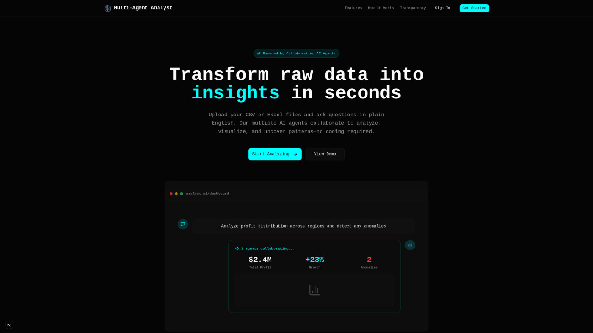
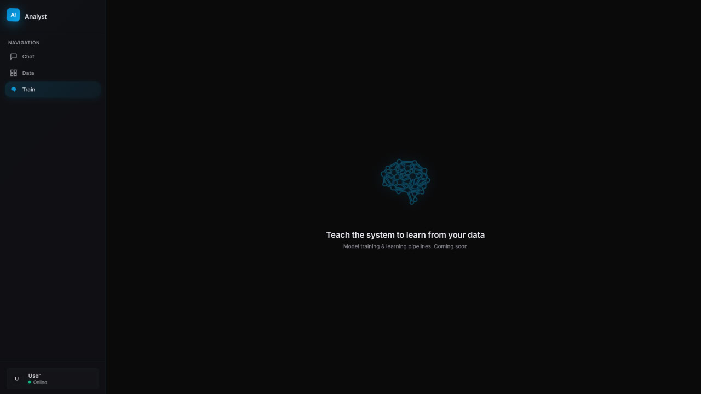
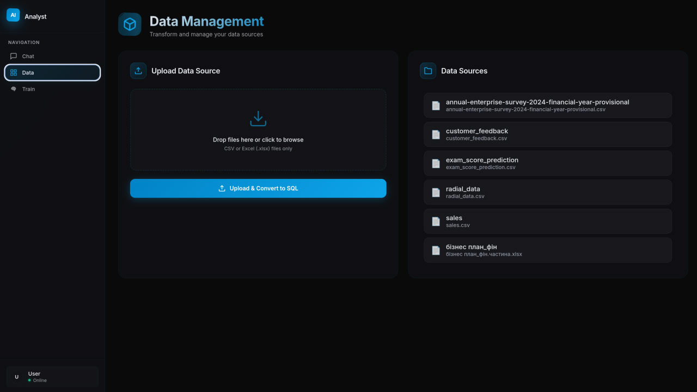
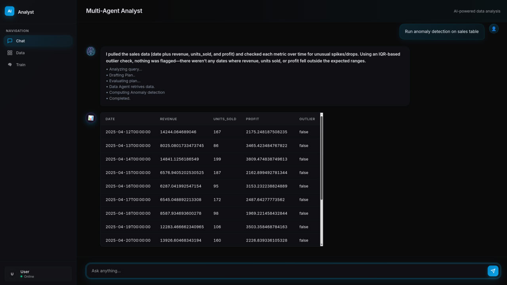

# **🧠 Multi-Agent Analyst**

### **Autonomous Data Analysis & Orchestration System**

**Upload Data → Agents Plan → Agents Execute → Self-Heal → Deliver Insights.**

🌐 **Live Demo:** https://agent-analyst.dev  

## **🚀 Overview**

**Multi-Agent Analyst** is a next-generation data intelligence platform powered by an autonomous orchestration engine. Unlike traditional analysis tools that require constant human guidance, this system employs a swarm of specialized AI agents capable of planning complex workflows, executing SQL queries, generating statistical models, and visualizing results.

The system’s defining feature is its Collaborative Agent Mesh. Rather than relying on a single model to handle an entire analysis end-to-end, it coordinates a team of specialized agents under a central Controller. The Data Agent establishes the dataset context, the Analysis Agent builds on it to compute results, and the Visualization Agent renders those results into charts—each step continuously informed by the last. This tight handoff keeps multi-step workflows coherent and avoids the context drift that makes standard chatbot pipelines unreliable.

### **🔬 Technical Highlights**

* **Hybrid Neuro-Symbolic Architecture:** Combines the deterministic stability of **Graph-based orchestration** (StateGraph) with the adaptive flexibility of **ReAct (Reasoning \+ Acting)** agents. This ensures high-level plan adherence while allowing individual agents to dynamically reason through unforeseen data anomalies at the node level.  
* **Deterministic DAG Planning:** The Planner Agent constructs a Directed Acyclic Graph (DAG) for every request, ensuring logical dependency resolution and enabling parallel task execution.  
* **Continuous Agent Coordination**  Multi-Agent Analyst runs as a cooperating team of specialists under a central Controller. Agents don’t take isolated turns—they operate as a coordinated pipeline, continuously sharing progress and context so each step builds directly on the last. The Controller routes work to the right specialist at the right time and carries context forward so the workflow stays coherent from ingestion → analysis → visualization.
* **Event-Driven Architecture:** Built on a non-blocking asyncio event loop with FastAPI, utilizing WebSockets for real-time agent thought streaming to the frontend.  
* **Enterprise-Grade Security Isolation**  Each analysis session runs in a strictly isolated PostgreSQL schema namespace with scoped permissions. Isolation is enforced at the database layer (schema + role scoping), not via application-side filtering, so sessions cannot access each other’s data.

## 📸 Interface
## 🎥 Demo
https://github.com/user-attachments/assets/f65c16ea-8d6a-44d8-9bd7-2f51a4832958

| | |
|---|---|
|  |  |
|  |  |

## **✨ Key Capabilities**

### **🤖 Autonomous Multi-Agent Swarm**

A hierarchical agent architecture ensures tasks are handled by specialists who communicate continuously:

* **Planner Agent:** Deconstructs user intent into a Directed Acyclic Graph (DAG) of executable steps.  
* **Controller Agent:** The central brain that orchestrates execution and manages state.  
* **Data Agent:** Handles SQL generation, schema introspection, and complex querying.  
* **Analysis Agent:** Performs statistical aggregation, regression, and ML computations.  
* **Visualization Agent:** Generates publication-ready charts with auto-scaling layouts.

### **🔁 Self-Healing Execution Engine**

The system possesses "resilience by design."

1. **Detection:** Execution failures are caught in real-time.  
2. **Diagnosis:** The **Resolver Agent** analyzes the stack trace and the agent's previous context.  
3. **Correction:** A corrected parameter set or logic path is generated.  
4. **Recovery:** The Controller rewinds execution to the failed step and applies the fix.

### **📂 Dynamic Data Ingestion Pipeline**

* **Zero-Config Upload:** Instant parsing of CSV/XLSX files.  
* **Auto-Schema Inference:** Intelligent detection of data types and relations.  
* **Sandboxed Environments:** Per-thread PostgreSQL schemas prevent data collision.  
* **Object Storage:** Redis-backed intermediate state storage for high-speed agent communication.

## **🏗 System Architecture**

The system utilizes a **Graph-Controlled ReAct Pattern**. The Controller enforces the global state machine (the Graph), while individual agents utilize the ReAct loop (Thought → Action → Observation) to solve specific tasks adaptively within that structure.

       ┌──────────────────────────────┐  
       │ 👤 User Request              │  
       └─────┬────────────────────────┘  
             │  
             ▼   
       ┌──────────────────────────────┐  
       │ 🎯 Intent Classifier         │  
       └─────┬────────────────────────┘  
             │ "Goal"  
             ▼  
       ┌──────────────────────────────┐  
       │ 💡 Planner Agent             │   
       └─────┬────────────────────────┘  
             │ "Execution Plan (DAG)"  
             ▼  
       ┌──────────────────────────────┐  
       │ ⚙️ Controller Agent          │   
       │      (Orchestration Engine)  │  
       ├─────┬──────────────────────┬─┤  
       │ S1  │ S2                   │ On Error  
       │     ▼                      ▼  
       │ 💾 DataAgent   📊 VisAgent   
       │     │                      │ "Error"  
       │     ▼ "Success"            ▼   
       │ ⚙️ Controller Agent 🛡️ Resolver Agent  
       │     ▲                      │ "Diagnose & Patch"  
       │     └─────── "Retry" ──────┘  
       └─────┬────────────────────────┘  
             │ "Aggregated Results"  
             ▼  
       ┌──────────────────────────────┐  
       │ 📝 Summarizer                │  
       └─────┬────────────────────────┘  
             │  
             ▼  
       ┌──────────────────────────────┐  
       │ ✅ Final Report & Charts     │  
       └──────────────────────────────┘

## **🧠 Workflow Example**

**User:** *"Create a line plot showing the trend of profit margins over the last 4 quarters."*

1. **Ingestion:** User uploads sales\_Q1\_Q4.csv. System infers schema and creates SQL table thread\_123.sales.  
2. **Planning:** Planner creates a 3-step plan: (1) Query Data, (2) Calculate Margin, (3) Plot Data.  
3. **Execution:** \- *Data Agent* executes SQL.  
   * *Visualization Agent* fails: KeyError: 'date'.  
4. **Resolution:** \- *Resolver Agent* inspects schema, realizes the column is named transaction\_date, not date.  
   * Updates the step parameters.  
5. **Success:** Controller re-runs the visualization step. A clean line chart is returned to the UI.
 
## 🔎 Transparency & Observability (Built on Trust)

Unlike black-box AI tools, Multi-Agent Analyst is designed so you can see exactly what happened during execution.

You get:
- Full execution logs for every run  
- Step-by-step agent actions (planning → querying → analysis → visualization)  
- Executed SQL visibility and intermediate results (where applicable)  
- Clear failure + retry trace when self-healing is triggered  

## **🛠 Technology Stack**

### **Backend & Orchestration**

* **Core:** Python 3.10+, FastAPI (Async)  
* **Orchestration:** Custom LangGraph-style State Machines  
* **LLM Integration:** OpenAI API / Ollama (Pluggable Local Models)  
* **Data Processing:** Pandas, NumPy, SQLAlchemy

### **Data Infrastructure**

* **Database:** PostgreSQL (with dynamic schema generation)  
* **Caching & State:** Redis  
* **Storage:** MinIO / Local Object Store

### **Frontend Experience**

* **UI:** High-performance HTML5/CSS3 (Ambient Glow Design System)  
* **Interactivity:** Vanilla JS (ES6+) for minimal latency  
* **Visualization:** Matplotlib, Base64 Stream Rendering

## **📄 License**

Distributed under the MIT License. See LICENSE for more information.

